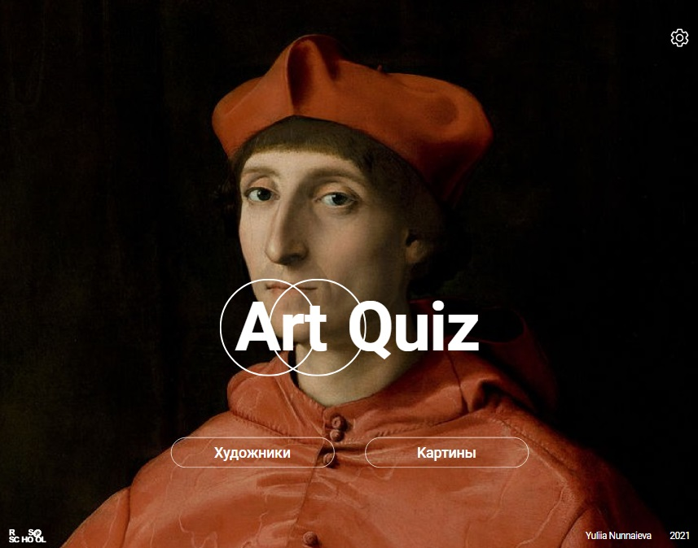

# Art Quiz

<kbd></kbd>

## Requirements

- based on the proposed initial data using JavaScript two types of questions are generated about artists and about paintings and answers to them;
- at the same time, the questions go sequentially, as they are written in the collection of initial data, and the answer options are created randomly;
- in total, based on the proposed initial data, it is necessary to generate 240 questions: 120 about artists, 120 about paintings;
- Quiz questions are divided into groups (categories). There are ten questions in each category;
- questions of one category do not have a single theme or other feature that unites them. Questions are divided into categories according to the order in which the data about the paintings are placed in the file with the source data. Category names are arbitrary;
- the passage of all questions of one category is one round of the game. Data about the rounds played and their results, as well as about the application settings are stored in local storage;
- for each question, four possible answers are generated. The user selects an answer by clicking on the card with it;
- for questions about artists on cards with answer options, the names of artists are indicated, for questions about paintings, cards with answer options show paintings;
- after the user selects an answer, an indicator appears, different for correct and incorrect answers, the correct answer is displayed, it becomes possible to move to the next question;
- after the end of the round, its result is displayed - the number of questions that were answered correctly;
- the results of all completed rounds are displayed on the category cards;
- for each category played, you can open a page with results, which displays all the pictures of the category - color or black and white, depending on whether they were guessed correctly. Clicking on an image displays information about it;
- the round played can be replayed, while the questions will be repeated, and the answer options will be different.

## Key Skills:

- OOP
- JavaScript Classes
- Modules in JavaScript
- webpack
- CSS3 animations
- Local Storage
- generating html through js

## https://kykysja-art-quiz.netlify.app
